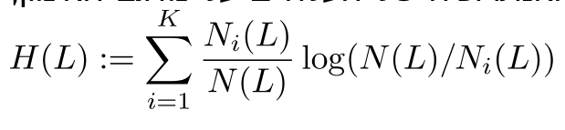
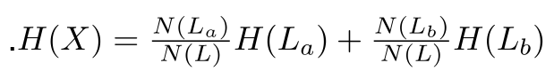
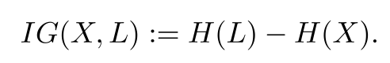

# Abstract
In this project we will implement an algorithm that learns to recognize handwritten digits based on pictures.

# Table of contents
<!--ts-->
   * [The learning algorithm](#The-learning-algorithm)
   * [Decision Trees](#Decision-Trees)  
   * [Select the decision tree](#Select-the-decision-tree)  
   * [Select the tree size](#Select-the-tree-size)  
   * [The data set format](#The-data-set-format) 
   * [The conditions groups](#The-conditions-groups)
   * [How to run](#How-to-run)
<!--te-->

The learning algorithm
=========

The learning algorithm receives as input sample examples of images, with each image attached to the real digit written in it. This is the label of the sample. The input of the algorithm, which is a set of samples each with its true label attached, is called a training set sample. The algorithm uses the training sample to construct a predictor prediction model. A prediction model is a function that maps every possible example to a label that corresponds to it according to the algorithm. The goal is for the model to be successful, meaning that in receiving a new sample, the model will usually give the most appropriate label for the sample. It is usually not possible to achieve 100% success, but hope for as high a success rate as possible.  
To measure the success rate of the algorithm, we will use a test set sample. This sample contains examples whose labeling is known to us but is not known to the algorithm. The prediction algorithm will receive the test sample as input, and will offer a label for each of the samples in the sample, according to the prediction model built by the learning algorithm. The success rate of the algorithm is the number of examples in the test sample for which the labels it suggested are indeed the correct label.  
In this project we will use a group of models called decision trees. To decide which model is best suited, the algorithm uses the training sample. The basic principle is that if the training sample is a representative set of samples, then a model that works well on the training sample (i.e. contracts correctly many of the sample labels in this sample) will also predict samples Others he had never seen.

Decision Trees
=========

The algorithm that we will implement will learn a prediction model of the decision tree type. Such a prediction model is a binary tree, which each of its internal nodes has a condition, and in each of its leaves has one of the possible values for labels. Each node has two children: one for the case where the condition is met and one for the case where the condition is not met. To classify an example according to a given decision tree, we start from the root of the tree and check the condition on the image. By compliance or non-compliance with the condition, we proceed to the appropriate child. If a condition also appears at this node, check it as well, and so on untill we reach a leaf.
  When we reach the leaf, we return the label written on it. This is the forecast of the model
for the example. An important detail in the implementation of a decision tree learning algorithm is determining the set of conditions from which the algorithm will select those that are worth using in the tree. We will mark this group with the letter C. Each condition in the group returns a "yes" or "no" according to the image received as input. For example, if the condition is "Is the pixel in the upper right corner higher than 230", the condition will return "yes" according to the pixel value in the image that the tree is currently trying to classify.

Select the decision tree
=========

The algorithm will use the training examples to build a decision tree as follows: Starting from a tree made of one leaf. The label of this leaf will be the most common digit in the training sample. Now, work in rounds: in each round one of the leaves in the tree is deleted, and replaced with a junction that has two children who are leaves. The value in each new leaf will always be the most common digit in the training sample for images that fit that leaf. The number of turns (i.e., the number of internal nodes that the tree will have) will be determined by the input parameter T.  
To decide which leaf to replace and what to put in its place, we will use a measure called information gain improvement. This measure measures the entropy change in the entropy of the tree. Entropy is a number that measures the degree of uncertainty associated with an example label according to the current tree.  
For each leaf in the tree, the entropy of the leaf on the training sample can be calculated as follows: denote N(L) the number of samples in the training sample that correspond to this leaf (ie correspond to the conditions in the path leading to the leaf). Denote Ni(L) The number of examples labeled i.  
The entropy of leaf L on the training sample, where K is the number of labels, is:

  
 
 If all the examples in the leaf have the same label, we will get H(L)=0, i.e. there is no uncertainty at all. However,
If the examples in the leaf are evenly distributed among all the labels, we get H(L) = log(K). This is the maximum value of possible uncertainty. The total entropy of the tree is a weighted sum of the entropy in all the leaves. Our goal in building the tree is to reduce the entropy of the classification. Therefore in each round we will increase the tree in a way that will reduce the total entropy as much as possible, using the following calculation:
Suppose an L leaf is replaced by some condition from group C. At the junction of the condition two child leaves will be formed, for the two possible outcomes of the condition. We will mark these leaves in La, Lb. From N examples in the training sample that correspond to L, we denote in N(La) the examples that correspond to the new leaf and in N(Lb) the examples that correspond to the new leaf Lb.
The weighted entropy of the two new leaves together is:

  
 
It will always be smaller than H(L). The information gain of condition X on leaf L is:

  
 
 In each round the algorithm will select the X and L for which N(L) *IG(X) is the maximum, when X is selected from
All the conditions in group C and L is selected from all the present leaves in the tree. Note that the improvement is multiplied by the number of N examples corresponding to the leaf L, so that the algorithm prefers an improvement that affects many examples rather than one that affects few.
After T rounds the algorithm stops when in its hands a decision tree with T internal nodes.

Select the tree size
=========

Tree size is an important parameter for the learning algorithm. Too small tree size will make it difficult to identify which sample label is appropriate, as not enough conditions have been tested that can affect the selection. Too large tree size can lead to the tree being very suitable for the samples in the training sample, but not particularly suitable for new samples. This is due to the phenomenon of over-fitting.
We will use a validation set to select the value of T. For our implementation we will only test T values that are a power of 2, from 1 to 2 to the power of L, where L is an input parameter (for example if L = 3 the sizes 1,2,4,8 will be tested). Furthermore, we will determine the percentage of input samples that will be used for the validation sample, and mark it P.
From the input to the algorithm, P% of the samples with their labels are randomly selected. These examples will be a validation sample, and will not be part of the training sample. The other samples received as input will be used as a training sample. For each of the possible values of T, we run the tree-building algorithm on the training sample for T, calculate the estimated algorithm success by running the prediction model on the samples in the validation sample and calculate the percentage of samples for which the algorithm's prediction model matches the true label.
At the end of the pass on all the values of T, we select the value of T for which the success on the validation sample was the highest. For this value, the tree learning algorithm is re-run on the entire sample, including the training part and the validation part. The generated tree is the output of the algorithm. The final success of the learning algorithm will be tested on the test sample.

The data-set format
========= 

We will run the algorithm on a data-set called MNIST. You can read about it here: / http://yann.lecun.com/exdb/mnist
MNIST contains images of 28x28 handwritten digits, with each pixel in the image represented by a value between 0 and 255 that determines its degree of gray. Therefore each image is represented by a vector 748 long of numbers between 0 and 255. The input to the algorithm will be a file describing a training sample, i.e. images and for each image what digit appears in it. We will use a data-set in CSV format described here: /https://pjreddie.com/projects/mnist-in-csv
The learning algorithm will receive a training sample in the format described and will produce a file describing the tree it studied. The prediction algorithm will then receive the file describing the tree and a test sample in the same format  and will return the list of predicted labels for the samples in the test sample according to the tree in the file.

The conditions groups
=========

To implement a tree learning algorithm on a sample from MNIST, one must determine the set of conditions C from which the algorithm can select. In this project we will implement two versions of the learning algorithm, which differ by the condition group C.
* First version: The condition group C will contain all the conditions from the form: Is the pixel value in the position (
x, y) in the picture is more than 128?
* Second version:
  Pre-processing- Before running the algorithm, we perform a pre-processing on the training set. The process we perform on the input is called Deskewing. After running the process we get a new CSV file with the corrections made during this process.
 Upon that, we chose a combination of 3 different set of conditions:
    1. The set of conditions we implemented in version 1 of the algorithm.
    2. Is the sum of the pixels on some diagonal in a given image is higher than the threshold.
    3. Is the sum of the pixels in a given square in the image larger than the threshold.

How to run
=========

Make sure you have java and pyhton on your machine.
1. clone the project.
2. Open the project folder and add your csv files- train and test files.
3. For building the tree run: ./learntree <1/2> 
 <L> <trainingset_filename> <outputtree_filename>
where: 
1/2 - which version of the learning algorithm to run. 1 - the first version with the given conditions, 2 - the second version.
P - the percent of the training set that should be used for validation
L - the maximal power of 2 for tree sizes T
trainingset_filename - the name/path of the training set file. The format of this file is the CSV format mentioned above. Each line represents a single example. The file can have any number of lines depending on the size of the input training set.  
outputtree_filename - the name/path of the file into which the algorithm will output the decision tree that it learned based on the training set.
4. For prediction run: ./predict <tree_filename> <testset_filename>
where:
tree_filename - the name/path of the file that describes the tree to use for prediction. This will be a file that was output by running "learntree", with the first version or the second version of the algorithm.  
testset_filename - the name/path of the file that includes the test examples which you should predict, in the CSV format mentioned above.

